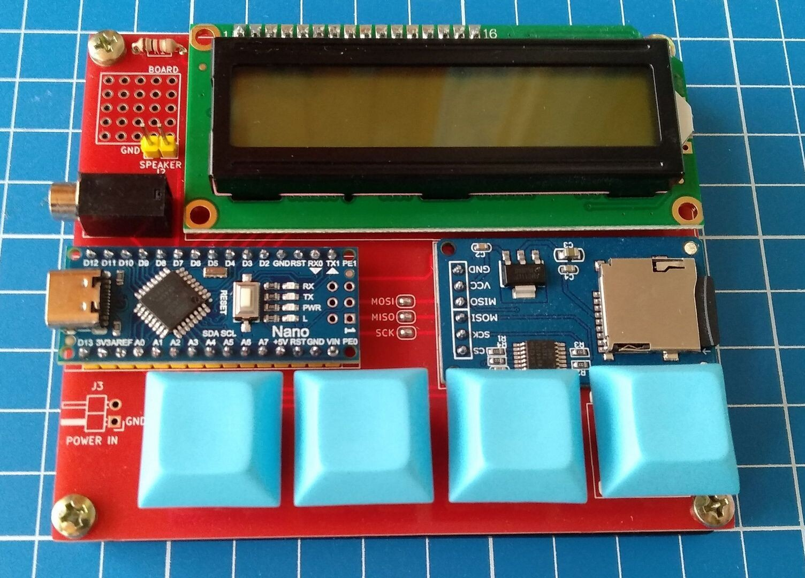

# Описание

Это *железная* часть проекта [TZXDuino_HF](https://github.com/maltsevda/TZXDuino_HF). Для работы с проектом, требуется программа [KiCad](https://www.kicad.org/). Если нет желания с ней возиться, то в Release'ах есть готовые gerber файлы. Они точно подходят для JLCPCB, но скорее всего подойдут и для других производителей плат.

Чуть подробнее о проекте написано в [статье на habr.com](https://habr.com/ru/post/590403/).

# Необходимые компоненты

### • Arduino Nano ver. 3.0

Я рекомендую поискать вариант с USB Type-C разъемом. На будущее. Например, подойдет [такой вариант с Aliexpress](https://aliexpress.ru/item/32788387125.html).

### • LCD 1602

Подойдет любой вариант без I2C модуля. Искать в магазине по ключевым словам: `LCD 1602`. Варианты без русской локализации стоят дешево, поэтому советую их. Я использовал [такой модуль](https://aliexpress.ru/item/32500978679.html).

### • Micro SD Card Reader

Настоящее название этого модуля: `Micro SD TF Card Memory Shield Module` и оригинал можно купить [тут](https://electropeak.com/micro-sd-tf-card-adapter-module). Перед покупкой убедитесь, что распиновка совпадает с платой. Свой модуль я покупал [на Алике](https://aliexpress.ru/item/32523546123.html).

### • Кнопки

Подойдут любые кнопки для механической клавиатуры. Например, Cherry MX или их клоны. И, конечно, keycaps'ы для них. Тут советовать не буду, у каждого свои предпочтения. Нужно 4 штуки.

### • Разъем 3.5mm Headphone Jack

Я крайне рекомендую брать [разъемы у этого продавца](https://aliexpress.ru/item/32819338639.html), потому что размеры на плате подогнаны именно под них. Если будете покупать другой вариант, возможно, придется немного модифицировать плату.

### • Резистор

Нужен один резистор для настройки контрастности дисплея. Его номинал зависит от дисплея, в моем случае - это 1 кОм. Подобрать номинал можно при помощи подстроечного резистора.

### • Гребенки

Как минимум 2 гребенки по 40 контактов. Но лучше взять с запасом. Искать в магазине по ключевым словам: `40 pin single row`. Я покупал [желтый вариант](https://aliexpress.ru/item/33012665900.html).

# Советы по сборке и пайке

Перед пайкой я рекомендую проверить загрузчик на Arduino Nano и, если стоит старый `Old Bootloader`, то обновить его. В последствии его обновить можно будет только разомкнув перемычки MISO, MOSI и SCK.

Припоем замыкаем перемычки MOSI, MISO и SCK.

У гребенок на Arduino Nano и LCD 1602 пластиковую часть снимать не надо. А вот модуль SD-карты должен плотно прилегать к плате, поэтому пластиковую часть надо аккуратно снять.

Если у ваших кнопок нет направляющих (маленьких пластиковых штырьков по бокам от основной пимпочки), то уплотнить и выровнять кнопки можно при помощи небольших кусочков изоленты.